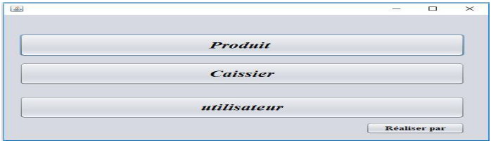
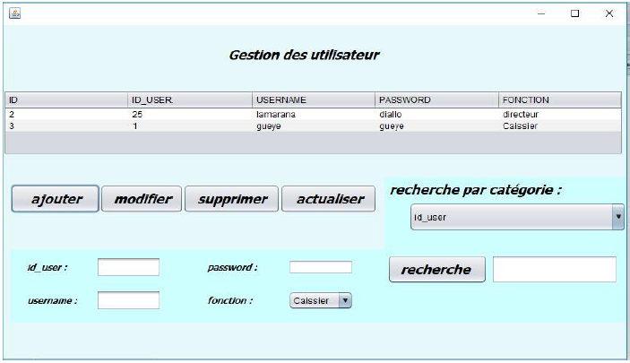
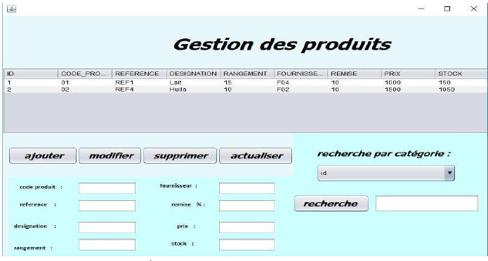
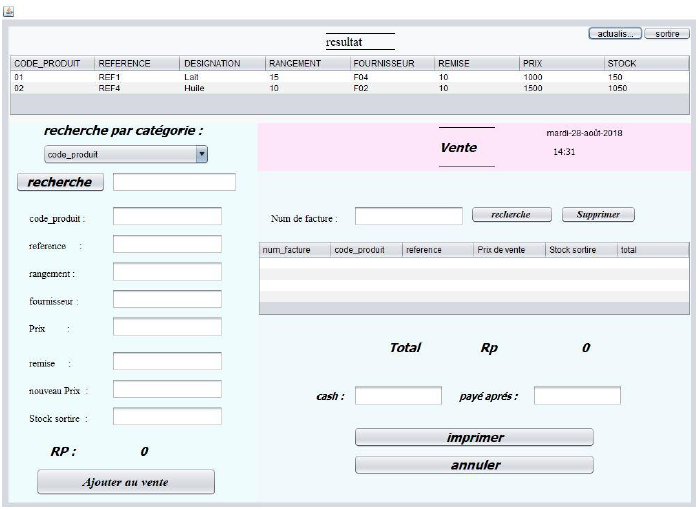

# Application Gestion de produits

Ce projet s'inscrit dans le cadre de l'évaluation du cours de "Manipulation des Données". Il consiste à mettre en place une application au choix de l'étudiant.

Mon choix s'est porté sur la création d'une application de gestion de produit. Pour y arriver, j'ai utilisé l'interface JFrame de l'IDE Netbeans avec les Swings pour la réalisation de l'application.

## Prérequis

Pour le bon fonctionnement de l'application, je recommande d'installer avant tout :
- Le "JDK"
- WampServer qui contient Apache
- L'IDE Netbeans
- La modélisation de la base de données a été faite par "PowerAMC"

## Instructions d'installation et d'exécution

Pour l'exécution de l'application, assurez-vous que les étapes suivantes ont été bien respectées :
1. Importer la base de données `gestion_produit.sql` dans phpMyAdmin
2. Lancer Netbeans
3. Importer le projet dans Netbeans
4. Faire un clic droit sur le projet, puis cliquer sur `Run`

## Accès à l'application

L'interface d'authentification permet d'accéder aux autres fonctionnalités de l'application. Pour vous faciliter l'accès, un identifiant et mot de passe par défaut sont mis à votre disposition.

### Création de l'utilisateur par défaut

Allez à la base de données et créez un utilisateur avec la syntaxe suivante :

```sql
INSERT INTO `utilisateur` (`id`, `id_user`, `username`, `password`, `fonction`) VALUES (1, 25, 'lamarana', 'diallo', 'directeur');
```

Identifiants par défaut :
- Username: _lamarana_
- Password: _diallo_

Après l'identification, vous avez la possibilité d'ajouter d'autres Utilisateurs, Caissiers ou encore des Produits.

### Quelques résultats
- **Authentification**
{width=50%}

- **Menu Principal**
{width=50%}

- **Gestion des utilisateurs**
{width=50%}

- **Gestion des Produits**
{width=50%}

- **Gestion des Caissiers**
{width=50%}